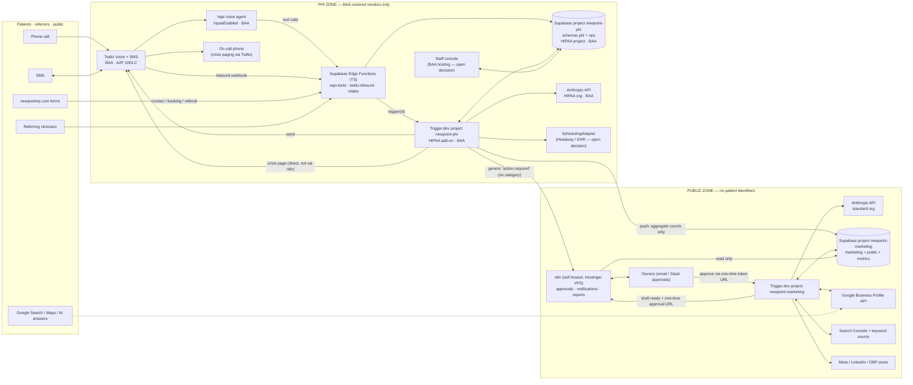

# Newpoint Automation Layer — Build Architecture

**Status:** plan only. Nothing here is implemented yet.
**Date:** 2026-10-07
**Scope:** seven systems. AI booking, Google Business Profile, local SEO keywords,
automated patient reviews, the AI referral and follow-up pipeline, AI search
visibility (GEO), and the AI social media engine.

This plan sits under the [project brief](../CLAUDE.md). Every content rule there
applies to anything an agent writes, including clinician titles, "assessment" rather
than "evaluation", no outcome claims, no drug brand names, and crisis guidance. The
compliance section of the brief also still governs the website's contact form.

---

## 0. The decisions that shape everything else

1. **Two zones, separated by infrastructure, not by naming.** The **PHI zone** holds
   anything that identifies a person as a Newpoint patient, prospective patient or
   referral. Only BAA-covered vendors may hold or process it. The **public zone**
   holds marketing data, public reviews, keywords, social posts and GEO results. It
   never sees a patient identifier. **n8n and the Hostinger VPS sit in the public
   zone, always.**
   - **Supabase:** two projects. `newpoint-phi` is the HIPAA project.
     `newpoint-marketing` is a standard project.
   - **Trigger.dev:** two projects, each with its own secret key, env set and deploy.
   - **Anthropic:** two orgs.
   - **Credentials never cross.** No credential for a PHI-zone project exists in a
     public-zone deploy or in n8n.
2. **Any contact record counts as PHI.** That includes a phone number, a name or an
   inquiry, even with no clinical detail. The site form already reasons this way at
   [`components/ui/onboarding-form.tsx`](../components/ui/onboarding-form.tsx): a name
   attached to a reason for contacting a psychiatric practice reveals that the person
   is seeking behavioural-health care. Under that reading, review requests, lead
   follow-ups and appointment reminders are all PHI workloads.
3. **Logic lives in TypeScript, and n8n only wires.** All agent logic is TypeScript
   (strict) running on Trigger.dev or in Supabase Edge Functions, plus SQL for
   Supabase. n8n workflows contain no Code nodes with business logic. They hold
   triggers, HTTP calls to typed endpoints, approval messages and notifications. If a
   workflow needs an `if` beyond simple routing, that logic moves into a task.
4. **Payloads carry IDs, never PHI.** Trigger.dev payloads, outputs, tags, metadata
   and logs contain opaque IDs only. A task loads PHI from Supabase inside `run()`
   and never returns it. This is "minimum necessary" applied to the job queue, whose
   dashboard every team member can see.
5. **The type system marks PHI.** PHI values are branded types (`Phi<T>`). The
   public Anthropic client, the n8n emitter and the logger accept only `PublicText`
   and IDs. Passing PHI to a public-zone sink is a **compile error**, so code review
   is not the only safeguard.
6. **No AI clinical judgement.** Agents schedule, remind, route and draft. They
   never assess symptoms, give medical advice or discuss medication. Crisis language
   on any channel triggers a deterministic escalation path (§5.8).
7. **The LLM never writes to a patient, and inbound text is untrusted.** Inbound
   SMS, referral documents and Google reviews are treated as untrusted input.
   - PHI-zone LLM calls have **no tools** and return only schema-validated enums or
     fields.
   - Every outbound patient message is a **fixed template**. Model free text never
     reaches a patient.
   - Values the LLM extracts, such as a phone number from a referral PDF, must be
     confirmed by staff before they can cause an outbound message.

---

## 1. System diagram



**Arrows that cross the zone boundary are the only allowed crossings.** There are
two, both one-way and outbound from the PHI zone. Nothing in the public zone holds a
credential that can reach into the PHI zone.

| Crossing | Content | Guard |
|---|---|---|
| PHI Trigger project → n8n webhook | `{ kind: "action_required", at }` and a link to the staff console. **No ticket category, no crisis flag, no names, numbers or reasons.** Ticket IDs are random UUIDs, never sequential. | The `N8nEvent` type accepts only that shape. **Crisis paging never goes through n8n** (§5.8). |
| PHI Trigger project → `newpoint-marketing` | Daily aggregate counts, such as review requests sent and bookings completed. | `ops.aggregate-metrics` writes using an insert-only key for one table. Small cells (< 5) are suppressed. Crisis counts are **never** exported. |

n8n has **no database connection to `newpoint-phi`** and **no Trigger.dev secret key
for either project**. Approvals complete through the one-time token callback URL
attached to each waitpoint. Before publishing, the publisher re-runs the content
rules and checks that the content hash matches what was approved (§5.7).

---

## 2. Vendors, BAAs and PHI exposure

| Vendor | Role | Touches PHI? | BAA needed | Notes |
|---|---|---|---|---|
| **Supabase** | System of record | `newpoint-phi`: **yes**. `newpoint-marketing`: **no**. | **Yes, for `newpoint-phi`**: Team plan or higher plus the HIPAA add-on, with the project flagged as a HIPAA project | Supabase's shared-responsibility model requires MFA enforced org-wide, point-in-time recovery, SSL enforcement, network restrictions and connection logging. Confirm that **Edge Functions** fall inside the BAA scope (D5). Hostinger is **not** on the `newpoint-phi` network allowlist. |
| **Trigger.dev** | Agent runtime (24/7) | `newpoint-phi` project: **yes** (tasks load PHI in memory). `newpoint-marketing`: **no**. | **Yes**: Cloud HIPAA add-on plus BAA, and the org moves to their HIPAA infrastructure | Two projects, with separate secret keys, env and deploys. Self-hosting is the fallback (D3). Self-hosting on Hostinger is **not** an option for PHI. |
| **Twilio** | SMS and voice carrier | **Yes** | **Yes**: SMS, voice and messaging scheduling are HIPAA-eligible. Free and trial accounts are not. | A2P 10DLC brand and campaign registration takes weeks, so start it on day one. |
| **Vapi** | Voice agent | **Yes** | **Yes**: a paid BAA add-on. `hipaaEnabled: true` means Vapi stores no recordings, logs or transcripts. | **Vapi's BAA does not cover the telephony leg.** Twilio needs its own BAA. D4 covers which LLM, speech-to-text and text-to-speech providers Vapi may use under `hipaaEnabled`, and whether each is inside Vapi's BAA. |
| **Anthropic API** | Reasoning | PHI org: **yes**. Public org: **no**. | **Yes, for the PHI org.** It is a dedicated HIPAA-ready organization provisioned through sales after the BAA is signed. | **Two orgs, two keys.** The HIPAA org restricts some features, so do not assume server tools such as web search are available there. GEO and social run in the public org. |
| **Scheduling system** (Headway or EHR) | Availability and appointments | **Yes** | **Yes**, with whichever system is chosen | See D1. Headway publishes no public API. |
| **n8n** on a Hostinger VPS | Orchestration, approval notifications, reports | **No, by construction** | No, **because** PHI never reaches it | Hostinger will not sign a BAA, which is why the boundary is strict. n8n holds only email/Slack notification credentials and a read-only key for `newpoint-marketing`. **It holds no Google, Meta or Trigger.dev publishing credentials**, so a compromised VPS cannot post as Newpoint or start tasks. |
| **Google** (GBP, Search Console) | Listing, reviews, search data | **No** | No | A review reply must **never** confirm that someone is a patient (§5.2). |
| **Meta / LinkedIn** | Social publishing | **No** | No | No patient stories, testimonials or photos of patients. |
| **Keyword data source** | Search volumes | **No** | No | Open decision D8. |
| **Staff console host** | PHI queue UI | **Yes** | **Yes** | Open decision D7. Vercel's standard plans are not covered, so the marketing site's host does not qualify by default. |

**Hard rule:** a PHI workload does not start until the BAA for every vendor in its
path is signed. Build order (§7) follows from this. Public-zone systems need no BAA,
so they ship first.

---

## 3. Repo and folder structure

The recommendation (D2) is a self-contained `automation/` package inside
`stdiohox/newpoint`. The registry says that all Newpoint build work lives in this
repo. The package gets its own `package.json` and its own **npm** lockfile, and it is
never imported by the Next.js site.

```
automation/
├── package.json                 npm; own lockfile; "type": "module"
├── package-lock.json
├── tsconfig.json                strict, noUncheckedIndexedAccess,
│                                exactOptionalPropertyTypes, noImplicitOverride
├── trigger.phi.config.ts        Trigger project newpoint-phi; dirs: ["src/trigger/phi"]
├── trigger.marketing.config.ts  Trigger project newpoint-marketing; dirs: ["src/trigger/marketing"]
├── eslint.config.mjs            no-restricted-imports: src/trigger/marketing/** may not
│                                import adapters/llm/anthropic-phi, adapters/messaging,
│                                adapters/voice, adapters/scheduling, lib/db-phi or
│                                any `phi/` directory (catches relative "../../phi/…")
├── .env.phi.example             names only, never values (one file per zone)
├── .env.marketing.example
├── src/
│   ├── trigger/                 THIN task definitions: schema, queue, schedule, call domain
│   │   ├── phi/                 deployed ONLY to the HIPAA project
│   │   │   ├── booking/         request.ts · reminders.ts · sync.ts · process-call-report.ts
│   │   │   ├── messaging/       inbound-sms.ts · send-sms.ts (consent + quiet hours + budget)
│   │   │   ├── reviews/         request-review.ts · metrics.ts
│   │   │   ├── referrals/       intake.ts · lead-follow-up.ts · referrer-update.ts
│   │   │   └── ops/             crisis-page.ts · retention-sweep.ts · aggregate-metrics.ts
│   │   └── marketing/           deployed ONLY to the marketing project
│   │       ├── gbp/             sync.ts · reply-drafter.ts · post-publisher.ts · nap-audit.ts
│   │       ├── seo/             keyword-research.ts · rank-tracker.ts
│   │       ├── geo/             probe.ts · recommendations.ts
│   │       ├── social/          planner.ts · drafter.ts · compliance.ts · publisher.ts
│   │       └── ops/             heartbeat.ts
│   ├── domain/                  PURE logic, no I/O; this is where the unit tests go
│   │   ├── eligibility/         review-eligibility.ts · follow-up-policy.ts
│   │   ├── crisis/              detect.ts (deterministic prefilter) · response.ts
│   │   ├── content-rules/       newpoint-rules.ts (the CLAUDE.md content rules as code)
│   │   └── scheduling/          slot-policy.ts (hours, modality, state licensure)
│   ├── adapters/
│   │   ├── scheduling/          SchedulingAdapter.ts · manual-queue.ts ·
│   │   │                        headway-handoff.ts · <ehr>.ts (once D1 is decided)
│   │   ├── llm/                 anthropic-phi.ts · anthropic-public.ts
│   │   ├── messaging/           twilio.ts
│   │   ├── voice/               vapi.ts (assistant config as typed code)
│   │   ├── google/              business-profile.ts · search-console.ts
│   │   ├── social/              meta.ts · linkedin.ts
│   │   └── n8n/                 emit.ts (accepts N8nEvent only)
│   ├── lib/
│   │   ├── phi.ts               Phi<T>, PublicText brands + the only constructors
│   │   ├── env.ts               zod-validated env, one schema per zone
│   │   ├── db-phi.ts            typed client for newpoint-phi (scoped role, not service_role)
│   │   ├── db-marketing.ts      typed client for newpoint-marketing
│   │   ├── logger.ts            structured logger; rejects Phi<T> at the type level
│   │   └── errors.ts            typed errors; FailureClass enum; vendor error text
│   │                            (which can echo inputs) is stripped before logging
│   └── prompts/                 versioned prompt modules (.ts), one per agent job
├── edge/                        Supabase Edge Functions (Deno, TypeScript strict)
│   ├── vapi-tools/              Vapi tool-call server: availability, request, message
│   ├── vapi-events/             end-of-call report → booking.process-call-report
│   ├── twilio-inbound/          signature-verified SMS webhook → messaging.inbound-sms
│   └── intake/                  site contact / booking / referral POST (BAA handler)
├── supabase/                    each project is a Supabase CLI workdir, and the CLI
│   │                            always reads <workdir>/supabase/, hence the nesting
│   ├── phi/supabase/            project newpoint-phi
│   │   ├── migrations/          *.sql, timestamped, forward-only
│   │   └── tests/               pgTAP: RLS, grants, default privileges, no SECURITY
│   │                            DEFINER leaks, views are security_invoker
│   └── marketing/supabase/      project newpoint-marketing
│       ├── migrations/
│       ├── seed.sql             fixtures (non-PHI by definition)
│       └── tests/
├── n8n/
│   ├── workflows/               exported JSON, committed; no business-logic Code nodes
│   └── README.md                credential names, webhook URLs, error-workflow wiring
└── test/                        vitest: domain unit tests, adapter contract tests
```

**Why this split:** `trigger/` stays thin, so every rule lives in `domain/`. That code
is pure and testable without Trigger, Twilio or Anthropic. Adapters are the only
place vendor SDKs are imported. Swapping Headway for an EHR, or Twilio for another
carrier, then touches one folder.

### The PHI type guard (sketch, not implementation)

```ts
// src/lib/phi.ts
declare const phiBrand: unique symbol;
declare const publicBrand: unique symbol;
export type Phi<T> = T & { readonly [phiBrand]: true };
export type PublicText = string & { readonly [publicBrand]: true };

// The ONLY way to make PublicText: from sources that cannot contain PHI.
export function publicText(template: PublicTemplate, vars: PublicVars): PublicText;

// src/adapters/llm/anthropic-public.ts
export function completePublic(input: { system: PublicText; user: PublicText }): Promise<PublicText>;
// Passing Phi<string> here is a type error.
```

The database layer returns `Phi<...>` for every column in the `phi` schema. Generated
types are post-processed to apply the brand.

---

## 4. Data model

There are **two Supabase projects**:
- **`newpoint-phi`**: the HIPAA project, schemas `phi` and `ops`.
- **`newpoint-marketing`**: a standard project, schemas `marketing`, `public` and
  `metrics`.

RLS is on for every table in both. `PUBLIC` and `anon` are revoked on `phi` and `ops`.
Views are `security_invoker`.

### Roles — `newpoint-phi`

| Role | Used by | Grants |
|---|---|---|
| `phi_tasks` | Trigger `newpoint-phi` project | The tables each task family needs. **Not `service_role`**, so RLS is not bypassed. |
| `phi_edge` | Edge Functions | Insert on inbound tables (`messages`, `inquiries`, `booking_requests`, `referrals`), select on what tool calls read |
| `staff_clinician`, `staff_admin` (auth users, role claim) | Staff console | Read/write through RLS keyed on the role claim. Only clinicians can set review exclusions, acknowledge crises and resume paused sequences. |
| `service_role` | Migrations only | Never deployed into a runtime |

Network restrictions allow only Trigger.dev's HIPAA egress, the Edge runtime and the
staff console host. **Hostinger is not allowlisted.**

### Roles — `newpoint-marketing`

| Role | Used by | Grants |
|---|---|---|
| `marketing_rw` | Trigger `newpoint-marketing` project | `marketing.*`, `public.*` read/write |
| `metrics_writer` | `ops.aggregate-metrics` (PHI project) | **Insert only** on `metrics.daily` and `metrics.agent_health` (one row per task per day), nothing else. Pushes are `ON CONFLICT DO NOTHING`, so a retry is a no-op. |
| `n8n_ro` | n8n | Read on `marketing.*`, `public.*`, `metrics.daily` |

### `phi` schema (BAA-covered)

| Table | Key columns | Notes |
|---|---|---|
| `contacts` | id (UUID), first_name, last_name, phone_e164, phone_verified_at, email, state (`NJ`/`PA`), minor_status (`adult`,`minor`,`unknown`), created_at | One row per person who has contacted the practice. No DOB, insurance ID or clinical data, matching the site's v1 rule. `minor_status` comes from the adapter or from staff. **`unknown` is treated as minor** for every automated flow. |
| `consents` | id, contact_id, kind (`sms_transactional`, `sms_marketing`, `review_requests`, `unencrypted_sms_ack`), granted_at, revoked_at, source, evidence | Append-only. Current state is a view. STOP/HELP keywords and any free-text opt-out ("stop texting me") revoke here. **`send-sms` refuses to send without an active consent.** |
| `inquiries` | id, contact_id, source (`voice`,`sms`,`web`,`referral`), reason (enum mirroring the site's constrained set), status, assigned_to, created_at | Never holds free-text clinical content. |
| `conversations` | id, contact_id, channel, external_ref (Twilio SID / Vapi call ID), started_at, closed_at | |
| `messages` | id, conversation_id, direction, body, intent, created_at, purge_after | `body` kept only as long as the retention policy allows (D16). Voice keeps the structured outcome, not a transcript. |
| `booking_requests` | id, contact_id, inquiry_id, requested_modality, requested_state, preferred_windows (jsonb), provider_pref, status, adapter, adapter_result (jsonb), created_at | `status`: `pending → offered → booked / handed_off / callback / abandoned` |
| `appointments` | id, contact_id, provider_id, external_ref, adapter, starts_at, modality, status (`scheduled`,`completed`,`cancelled`,`no_show`), source_booking_request_id | Mirror of the scheduling system, kept in sync by the adapter. |
| `referrals` | id, referrer_org, referrer_name, referrer_contact, contact_id, document_path (private bucket), extracted (jsonb), extraction_confidence, status, received_at | Documents go in a private Storage bucket. Only the HIPAA org's LLM ever reads them. |
| `follow_ups` | id, contact_id, kind (`lead`,`no_show`,`post_visit_logistics`,`referrer_update`), step, due_at, status, trigger_run_id | The source of truth for sequence state. The Trigger run reads it before every send. |
| `review_requests` | id, appointment_id, contact_id, scheduled_for, sent_at, status (`pending_clinician_window`,`sent`,`excluded`,`skipped`) | One per eligible appointment. A cap enforced in SQL limits each contact to one per 12 months. No click tracking in v1: a per-patient tracking link would need BAA-covered redirect hosting. |
| `review_exclusions` | contact_id, set_by (provider), reason_code, set_at | Lets a clinician exclude a patient from review requests without stating why. |
| `crisis_events` | id, contact_id, channel, conversation_id, detected_by (`keyword`,`llm`,`voice`), detected_at, auto_response_sent_at, paged_at, staff_ack_at, staff_ack_by, sequences_resumed_at, resumed_by | Every escalation is recorded, paged and acknowledged. Only a clinician can resume sequences. |
| `audit_log` | id, actor (user **or** task id), action (`read`,`write`,`send`), entity, entity_id, at | Append-only (no UPDATE/DELETE grant). Covers reads as well as writes, by staff **and** by automated tasks. Holds no PHI values. |

`ops` (in `newpoint-phi`) holds `ops.agent_health`. Its columns are task_id,
last_success_at, last_failure_at and failure_class. `failure_class` is a **fixed
enum** (`vendor_4xx`, `vendor_5xx`, `rate_limited`, `validation`, `timeout`,
`unknown`). Raw error text never goes there, because vendor errors repeat the inputs
that caused them.

### `public` schema in `newpoint-marketing` (non-PHI reference data)

| Table | Notes |
|---|---|
| `providers` | id, name (legal), display_name, role, states_licensed, scheduling_ref, accepts_new_patients. `display_name` follows the brief's "Dr." condition. |
| `practice_facts` | Key/value copy of the confirmed facts in `lib/content.ts` (NAP, delivery line). Agents read this table and never invent facts. |

### `marketing` schema in `newpoint-marketing` (public zone)

| Table | Notes |
|---|---|
| `keywords` | term, cluster, intent, state, town, service_slug, volume, difficulty, source, first_seen |
| `keyword_snapshots` | keyword_id, date, gsc_position, impressions, clicks |
| `content_backlog` | id, kind (`page`,`faq`,`schema`,`gbp_post`,`social`), target, rationale, source_agent, status. Site changes are made by a human in the site repo; agents never commit to it. |
| `gbp_reviews` | google_review_id, rating, text, author_display, created_at, reply_draft, reply_status, replied_at. **Never joined to `phi`.** |
| `gbp_posts` | id, body, cta_url, media, status, scheduled_for, published_ref |
| `social_posts` | id, channel, body, media, topic, keyword_ids, compliance_report (jsonb), rounds, approval_status, approval_token_id, published_ref, published_at |
| `geo_prompts` | id, prompt, intent, state, active |
| `geo_runs` | id, prompt_id, engine, run_at, answer_excerpt, newpoint_mentioned, newpoint_cited, cited_urls, competitors_mentioned |

### `metrics` schema in `newpoint-marketing`

| Object | Notes |
|---|---|
| `metrics.daily` | Pushed by `ops.aggregate-metrics`: inquiries, bookings, review requests sent, follow-up conversions. Counts below 5 are stored as null (shown as `<5`). **Crisis counts are never exported.** This is the only PHI-derived data outside `newpoint-phi`. |
| `metrics.agent_health` | Daily push of `ops.agent_health`, already reduced to an enum, so the marketing heartbeat can report PHI-side task health. Success and failure are **dates, not timestamps**: for an event-driven task the exact time is the time of a patient interaction. `ops.crisis-page` is refused by a CHECK, because any row for it is a crisis count. |

---

## 5. Agents

"Agent" here means a Trigger.dev task, or a small group of tasks, that has a single
job. LLM routes use one model per tier:

| Tier | Model | Routes | Config |
|---|---|---|---|
| Low effort: classification and intent | `claude-haiku-4-5` | `messaging.inbound-sms` intent (HIPAA org) | No `effort` parameter on Haiku 4.5. Short `max_tokens`, structured output. |
| Drafting | `claude-sonnet-5-5` | `gbp.reply-drafter`, `social.planner`, `social.drafter`, `seo.keyword-research` clustering, `geo.probe`, `geo.recommendations` | `effort: "medium"` set explicitly, because Sonnet 5.5 defaults to `high` |
| Extraction and compliance review | `claude-opus-5-5` | **Only** `referrals.intake` extraction (HIPAA org) and `social.compliance` review | `effort: "high"` set explicitly, because Opus 5.5 defaults to `medium` |

Any new LLM route defaults to `claude-sonnet-5-5`. Moving it to `claude-opus-5-5` is a
decision recorded here, not a per-task choice. The HIPAA org's feature restrictions
apply per model, so confirm Haiku 4.5 and Opus 5.5 are both available there before
Phase 5.

Structured outputs (`output_config.format`) are used wherever the result is parsed.
Every LLM result is schema-validated with zod. A validation failure **flags the item
for a human and never falls back to a default category**.

### 5.0 The outbound-message contract — every SMS, every agent

Every agent that texts a patient goes through `messaging/send-sms.ts`, and nothing
else is allowed to call Twilio. `send-sms` refuses to send unless all of these hold:

- **Consent.** An active `sms_transactional` consent exists, with
  `contacts.phone_verified_at` set.
- **Quiet hours.** 08:00–21:00 in the recipient's local time. Anything outside the
  window is deferred, not dropped. The only exception is the crisis auto-response,
  which replies to a message the patient just sent.
- **Template.** Fixed templates with typed slots: date, time, provider display name,
  link. Templates use **neutral wording**: "Newpoint" and logistics only, never
  "psychiatric", a condition or a medication. Phones are shared and lock-screen
  previews are visible. The same applies to voicemail.
- **Budget.** A global daily send budget, plus a per-number rate limit. Exceeding the
  global budget trips a circuit breaker and pages Koret ops. Twilio Geo Permissions
  are set to US only.
- **Idempotency.** The key is `(template, entity id, step)`, so a retry never
  double-sends.

### 5.1 AI booking — PHI zone

| Agent | Trigger | Inputs | Outputs | Schedule / timing |
|---|---|---|---|---|
| **Voice receptionist** (Vapi assistant, config in `adapters/voice/vapi.ts`) | Inbound call to the practice line via Twilio | Caller audio. Tools: `check_availability`, `request_booking`, `take_message`, `crisis_transfer` | Tool calls to `edge/vapi-tools`. The end-of-call report goes to `edge/vapi-events` | 24/7. States at the start of the call that it is an automated assistant. |
| **Vapi tool server** (`edge/vapi-tools`) | Vapi tool-call webhook. Authenticated with a shared secret checked in constant time, and the call ID is verified against Vapi's API before any write. | Tool name and arguments, zod-validated | Slots from `SchedulingAdapter.getAvailability`, a `booking_requests` row, or a message ticket. **Writes create requests only.** A caller cannot cancel or alter an existing appointment by voice in v1. | Synchronous, latency budget < 800 ms. Heavy work is deferred to Trigger. |
| **`booking.process-call-report`** | `vapi-events` triggers it with `{ callId }` | Call outcome (structured), contact | Updated `conversations` and `booking_requests`. Triggers `booking.request` or creates a callback ticket | Per call |
| **`booking.request`** | A new `booking_requests` row (from voice, SMS or web) | `{ bookingRequestId }` | `SchedulingAdapter.book()` produces an appointment, a deep-link handoff or a staff callback. Sends an SMS confirmation. | Per request. Retries with backoff. Idempotency key = request ID. |
| **`messaging.inbound-sms`** | `edge/twilio-inbound` with `{ messageId }`. The Twilio signature is verified against the exact public URL, and duplicate `MessageSid`s are dropped. | Message plus conversation history | Intent enum (`book`, `reschedule`, `cancel`, `logistics_question`, `stop`, `help`, `crisis`, `other`) → a routed task or a **template** reply | Per message. Crisis detection, then STOP/HELP, run deterministically before any LLM call. The classifier has no tools and only its enum output is used. |
| **`booking.reminders`** | Cron | Upcoming `appointments` | SMS at 48 h and 2 h before (subject to §5.0 quiet hours). A no-show creates a `follow_ups` row: **established patients go to a clinician review queue**, new patients get one automated rebooking offer. | `*/15 * * * *`, America/New_York |
| **`booking.sync`** | Cron, plus adapter webhooks where the system supports them | Adapter appointment feed | Upserted `appointments`. A newly `completed` appointment emits a review-eligibility check | Every 15 min (iCal-only adapters: hourly) |

**`SchedulingAdapter` interface (the D1 boundary):**

```ts
export interface SchedulingAdapter {
  readonly id: "manual-queue" | "headway-handoff" | (string & {});
  readonly capabilities: { readAvailability: boolean; writeBooking: boolean; webhooks: boolean };
  getAvailability(q: AvailabilityQuery): Promise<Result<Slot[], AdapterError>>;
  book(req: Phi<BookingCommand>): Promise<Result<BookingOutcome, AdapterError>>;
  cancel(ref: AppointmentRef): Promise<Result<void, AdapterError>>;
  listAppointments(window: DateRange): Promise<Result<Phi<AppointmentRecord>[], AdapterError>>;
}
export type BookingOutcome =
  | { kind: "booked"; appointment: AppointmentRef }
  | { kind: "handoff"; url: string }             // generic provider booking page; never prefilled with contact data
  | { kind: "callback"; ticketId: string };      // staff completes it
```

Three implementations are planned, in this order:

1. **`manual-queue`** (ships first, works with any system). The agent collects
   preferred windows and creates a staff ticket. A human books it in the real system.
   This makes the booking agent useful before D1 is decided.
2. **`headway-handoff`.** Headway publishes no public API. The best available is an
   iCal feed, which gives read-only busy times at most, so this adapter can only
   **hand off** to the provider's Headway booking page. It cannot write a booking.
3. **`<ehr>`.** A full read/write adapter once a system with a real API and a BAA
   is chosen.

Booking rules live in `domain/scheduling/slot-policy.ts` and must hold for every
adapter:
- **Licensure:** only providers licensed in the patient's state are offered.
- **Modality:** the patient's choice of in-person or telehealth must be one the
  provider offers.
- **New patients:** the first visit is the comprehensive psychiatric assessment.
- **Minors:** guardian flow (D18).

### 5.2 Google Business Profile — public zone

| Agent | Trigger | Inputs | Outputs | Schedule |
|---|---|---|---|---|
| **`gbp.sync`** | Cron | GBP API: reviews, performance metrics | `marketing.gbp_reviews`. A new review triggers `gbp.reply-drafter` | Hourly |
| **`gbp.reply-drafter`** | New review | Review text, delimited and marked as untrusted. Rating, public facts. **No tools.** | Draft reply, `waitpoint` token, n8n approval message showing the **raw review beside the draft** | Per review. Approval times out after 72 h, then a reminder is sent. **Never auto-posts.** |
| **`gbp.post-publisher`** | Approved `gbp_posts` | Post body, CTA | Published GBP post | Weekly slot, from the social planner |
| **`gbp.nap-audit`** | Cron | GBP listing fields vs `public.practice_facts` | Mismatch report → `content_backlog` | Monthly. **Blocked** until the legal name and address are confirmed (D11). |

**Review-reply policy (written into the prompt and checked by a separate validator):**
- A reply never confirms or implies that the reviewer is or was a patient. HHS has
  fined providers for exactly this.
- No reference to any treatment, visit, condition or detail from the review.
- A complaint gets a generic invitation to call the practice line.
- The validator rejects drafts containing "your visit", "your treatment", "your
  appointment", a provider name, or any clinical term. It also rejects any draft
  that names the reviewer or repeats text from the review, which also stops injected
  instructions in a review from reaching the reply.

### 5.3 Local SEO keywords — public zone

| Agent | Trigger | Inputs | Outputs | Schedule |
|---|---|---|---|---|
| **`seo.keyword-research`** | Cron, plus manual run from the Trigger.dev dashboard (never from n8n, which holds no Trigger.dev key, §2) | Seed matrix (services × towns × NJ/PA × intent), Search Console queries, volume source (D8) | Clustered `marketing.keywords`, plus `content_backlog` items such as page gaps, FAQ candidates and GBP categories | Monthly |
| **`seo.rank-tracker`** | Cron | Search Console API | `keyword_snapshots`, and movers in the weekly report | Weekly, Monday 06:00 ET |

Seed terms use the owners' vocabulary ("psychiatric assessment", "mental and
behavioral care"). They keep "psychiatric evaluation" as a tracked query because the
brief keeps it for query coverage. Output feeds three consumers: the site backlog
(applied by a human), the social planner and GEO prompts.

### 5.4 Automated patient reviews — PHI zone

| Agent | Trigger | Inputs | Outputs | Schedule |
|---|---|---|---|---|
| **`reviews.request-review`** | `booking.sync` marks an appointment `completed` and the eligibility check passes. A `review_requests` row is created as `pending_clinician_window` and **shown in the treating clinician's console queue for 24 h** (`wait.for`), so they can exclude the patient. Eligibility is re-checked before sending. | `{ appointmentId }` | One SMS with the practice's generic Google review link. **No reminder and no click tracking in v1** (D14). | Sends only 10:00–19:00 local |
| **`reviews.metrics`** | Cron | `review_requests` | Counts included in the `ops.aggregate-metrics` push to `metrics.daily` | Daily |

**Eligibility (`domain/eligibility/review-eligibility.ts`). Every condition must hold:**
- Consent is on file: `review_requests` and `sms_transactional` are active.
- There is no `review_exclusions` row for the patient. Clinicians can exclude
  anyone, no reason required.
- There is no `crisis_events` row for the patient in the last 90 days.
- No review request has been sent to the patient in the last 12 months.
- `minor_status = 'adult'`. Both `minor` and `unknown` are excluded.
- The appointment was completed, not cancelled or a no-show.

**Compliance rules for the review program:**
- **No review gating.** Every eligible patient gets the same message. Patients are
  not filtered by sentiment, and an unhappy patient is not routed to private
  feedback instead. Google prohibits selective solicitation, and the FTC's
  consumer-review rule targets review suppression.
- **No incentives.**
- **Neutral SMS wording:** the message names "Newpoint" and nothing clinical.
- **The review link is the only URL in the message.**

### 5.5 AI referral and follow-up pipeline — PHI zone

| Agent | Trigger | Inputs | Outputs | Schedule |
|---|---|---|---|---|
| **`referrals.intake`** | `edge/intake` (clinician referral form or document upload) or a fax-ingest path (D17) with `{ referralId }` | Referral document from the private bucket, treated as untrusted | Structured extraction with the HIPAA-org LLM (no tools, schema output): patient contact, referrer, requested service, urgency flag. **Every referral goes to staff review.** Extracted values are shown escaped and need staff confirmation before a `contacts` row can receive any message. **Urgent or high-risk referrals go straight to a clinician and never enter an automated sequence.** | Per referral |
| **`referrals.lead-follow-up`** | A new self-submitted `inquiries` row with no booking, a verified phone, and consent captured at submission | `{ inquiryId }` | Durable sequence: SMS at +5 min, +24 h and +72 h, subject to §5.0. A step is skipped if the patient is booked, has opted out, or has a crisis event. **Referral-sourced contacts are not enrolled.** They gave their number to the referrer, not to Newpoint, so their first contact is a staff call. | Waits via `wait.for` (checkpointed, no compute while waiting). `follow_ups` is re-read before each send. |
| **`referrals.referrer-update`** | A referral-sourced appointment is booked | `{ appointmentId }` | "Received and scheduled" notice to the referring clinician. Treatment-purpose disclosure, minimum necessary: no diagnosis or notes. | Per booking. **Held** until counsel confirms the Part 2 and NJ question (D12). |
| **`referrals.no-show`** and **`post-visit-logistics`** | `follow_ups` rows | `{ followUpId }` | Rebooking offer, or non-clinical logistics (forms, telehealth link help) | Per row |

**What the follow-up agent never does:** discuss symptoms, medication or diagnoses.
Any message like that gets "a member of our team will call you", a staff ticket and,
if crisis language is present, §5.8.

**`edge/intake` hardening.** The public form is the cheapest way for an attacker to
make Newpoint send SMS to arbitrary numbers, so every layer applies:
- **Direct POST.** The browser posts straight to the Edge Function. No Next.js route
  handler, server action or middleware sits in between, and there is no analytics on
  the form's fields or URL.
- **Bot and abuse checks.** Cloudflare Turnstile, plus rate limits per IP and per
  phone number.
- **Phone verification first.** A one-time code, or a "reply YES" confirmation, must
  set `phone_verified_at` before any follow-up starts. Consent wording is captured
  verbatim into `consents.evidence`.

### 5.6 AI search visibility (GEO) — public zone

| Agent | Trigger | Inputs | Outputs | Schedule |
|---|---|---|---|---|
| **`geo.probe`** | Cron | Active `geo_prompts`, for example "psychiatric nurse practitioner Lawrence Township NJ telehealth" or "ADHD medication management Pennsylvania telehealth" | `geo_runs`: whether Newpoint was mentioned or cited, which URLs were cited, which competitors appeared. Uses the public Anthropic org with the web search server tool. Other engines depend on D9. | Weekly |
| **`geo.recommendations`** | Cron | Four weeks of `geo_runs`, the site's schema.org coverage, `keywords` | `content_backlog` items such as FAQ answers to add, schema gaps and citation targets (directories) | Monthly |

GEO recommendations are **advice to a human editing the site repo**, never automatic
commits. Each recommendation is checked against the brief before it enters the
backlog. Schema advice must respect the rules in CLAUDE.md:
- never `Physician`
- no `areaServed` on `Person`
- no synthetic address
- `hasCredential` and NPI stay omitted until supplied

### 5.7 AI social media engine — public zone

The pattern is prompt chaining, then evaluator-optimizer, then human-in-the-loop.

| Agent | Trigger | Inputs | Outputs | Schedule |
|---|---|---|---|---|
| **`social.planner`** | Cron | Keyword clusters, services, `practice_facts`, awareness calendar (e.g. Mental Health Awareness Month) | Calendar of topics × channels → `social_posts` (status `planned`) | Weekly, Monday 07:00 ET |
| **`social.drafter`** | Planned post | Topic, channel constraints, brand voice | Draft body + alt text | Per post |
| **`social.compliance`** | Draft created | Draft + `domain/content-rules` | Pass, or feedback that sends it back to the drafter. **At most 3 rounds**, then it goes to a human with the report. | Per draft |
| **`social.approval`** | Compliance passed | Draft + its content hash | `wait.forToken`. n8n sends the owner the draft and the token's one-time callback URL. The approval completes the token with the hash. | Times out after 72 h, then the post expires. **Nothing publishes without approval.** |
| **`social.publisher`** | Approved | Post | **Before publishing**, re-runs `newpoint-rules` and checks that the content hash equals the approved hash. On a mismatch it refuses. Then posts to Meta / LinkedIn / GBP and stores `published_ref`. Publishing credentials live only in this Trigger project, never in n8n. | At the scheduled slot |

**Content rules enforced in code (`newpoint-rules.ts`), sourced from CLAUDE.md:**
- "Dr." appears only with the credentials or "nurse practitioner" in the same post.
- Never "physician" or "psychiatrist" for either provider.
- No outcome claims (weight loss or otherwise).
- No drug brand names.
- No testimonials or patient stories.
- No pricing or discounts.
- "Assessment", not "evaluation", as the appointment name.
- Crisis line (988 / 911) on any post about crisis, suicide or self-harm topics.
- No unconfirmed regulated facts (hours, address, payers not marked `confirmed`).
- The deterministic checks run first, and an LLM review catches tone and implied
  claims.

### 5.8 Crisis handling — PHI zone, cross-cutting

- `domain/crisis/detect.ts` runs **first, on every inbound SMS and on voice tool
  calls**. It is a deterministic keyword and phrase list, conservative by design, so
  false positives are acceptable. The LLM intent classifier is a second detector,
  never the only one.
- On detection the patient immediately gets a fixed, clinician-approved message with
  988 and 911. The message also says the practice line is not monitored around the
  clock, which keeps the brief's `CRISIS` wording.
- A `crisis_events` row is written, and **`ops.crisis-page` pages the on-call
  clinician directly by Twilio SMS and voice call**, inside the PHI zone. The page
  repeats every 10 minutes until acknowledged and escalates to the second provider
  after 30 minutes. **n8n is not in this path**, because a single VPS with no BAA
  cannot be the crisis channel.
- **Dead-man check.** A PHI-side cron confirms that every `crisis_events` row was
  paged within 2 minutes. If one was not, it pages again and alerts Koret ops.
- **Sequences pause, reminders don't.** Automated sequences for that contact pause:
  lead follow-up, reviews, logistics. Appointment reminders keep running. **Only a
  clinician can resume sequences**, and the resume is recorded in `crisis_events`.
- **Voice:** the agent gives 988 and 911 and offers `crisis_transfer` to 988.
  `detect.ts` should also run on Vapi's live transcript events, if Vapi allows that
  under `hipaaEnabled`. If it does not, the voice LLM is the only detector on calls,
  and that is recorded as an accepted risk under D15. The exact script needs
  clinician sign-off (D15).

### 5.9 Ops

| Agent | Trigger | Output | Schedule |
|---|---|---|---|
| **`ops.heartbeat`** (marketing project) | Cron | Stale-agent and failure digest from `metrics.agent_health` (enum only) → n8n → owners | Hourly check, daily digest 08:00 ET |
| **`ops.aggregate-metrics`** (PHI project) | Cron | Pushes counts and `agent_health` to `newpoint-marketing` via the insert-only `metrics_writer` key | Daily 02:00 ET |
| **`ops.crisis-page`** (PHI project) | `crisis_events` insert, plus a 1-minute dead-man cron | Direct Twilio page to on-call, repeating until acknowledged | Event + `* * * * *` |
| **`ops.retention-sweep`** (PHI project) | Cron | Purges `messages.body`, documents and other data past `purge_after` | Daily 03:00 ET |
| **n8n error workflow** | Any n8n failure | Alert to Koret ops | Event |

Every Trigger task sets explicit retries. Vendor calls use `retry.fetch` limited to
429 and 5xx responses. Idempotency keys are derived from row IDs. Any SMS-sending
queue has `concurrencyLimit` set, both to stay inside the Twilio rate limit and to
prevent duplicate sends.

---

## 6. PHI boundaries — the rules in one place

| Component | PHI? | Why |
|---|---|---|
| Vapi voice agent, `edge/vapi-*` | **Yes** | Caller identity plus intent to seek psychiatric care |
| Twilio SMS and voice | **Yes** | The phone number plus the Newpoint relationship |
| `edge/twilio-inbound`, `edge/intake` | **Yes** | Inbound contact data |
| Trigger project `newpoint-phi`: `booking.*`, `messaging.*`, `reviews.*`, `referrals.*`, `ops.crisis-page`, `ops.retention-sweep`, `ops.aggregate-metrics` | **Yes** | They load `phi` rows. `aggregate-metrics` exports counts only, but it reads `phi`, so it runs on the PHI side. |
| Anthropic **HIPAA org** | **Yes** | SMS intent, referral extraction |
| Supabase project `newpoint-phi` (`phi`, `ops`, private Storage bucket) | **Yes** | System of record |
| Staff console | **Yes** | Shows PHI to the workforce |
| Trigger project `newpoint-marketing`: `gbp.*`, `seo.*`, `geo.*`, `social.*`, `ops.heartbeat` | **No** | They read `newpoint-marketing` only |
| Anthropic **standard org** | **No** | Only `PublicText` can reach it |
| Supabase project `newpoint-marketing` | **No** | No patient identifiers. Counts are suppressed below 5, and crisis counts are never exported. |
| n8n / Hostinger | **No** | Receives `{ kind: "action_required", at }`, approval drafts and aggregates only |
| GBP, Search Console, Meta, LinkedIn | **No** | Public content only |

**Enforcement, in layers:**
1. **Types.** `Phi<T>` and `PublicText` brands mean a public sink cannot accept PHI.
   ESLint `no-restricted-imports` stops marketing tasks from importing PHI adapters.
2. **Infrastructure.** Each zone has its own Supabase project, its own Trigger.dev
   project and its own Anthropic org. A marketing deploy has no PHI credential in its
   environment at all. n8n has no credential for anything in the PHI zone, and
   Hostinger is not on `newpoint-phi`'s network allowlist.
3. **Database.** RLS everywhere. Runtimes use scoped roles, never `service_role`.
   pgTAP asserts:
   - RLS is on for every table;
   - `PUBLIC` has no grant on `phi`;
   - no `SECURITY DEFINER` functions are exposed;
   - every view is `security_invoker`;
   - `metrics_writer` can only insert.
4. **Queue hygiene.** Payloads are zod schemas made only of IDs. A test fails if any
   task schema contains a field named like a contact attribute.
5. **Logs and errors.** The logger rejects `Phi<T>`. Trigger run outputs are IDs and
   statuses only. `errors.ts` maps vendor errors to a `FailureClass` enum and drops
   their message text, which can echo phone numbers and names.
6. **Staff console.** Requirements:
   - SSO with MFA, no shared accounts, and a 15-minute idle session timeout;
   - RLS keyed on the role claim (`staff_clinician` / `staff_admin`);
   - every record read and write goes to `audit_log`;
   - extracted and inbound text is always rendered escaped.
7. **Secrets.** Each secret has an owner, is rotated every 90 days and on any staff
   change, and is scoped to the minimum. Revocation runbooks live in
   `automation/n8n/README.md` and alongside each adapter.
8. **Review.** Every PR touching `automation/` runs `healthcare-reviewer` and
   `security-reviewer`. New schema runs `database-reviewer`.

**Also out of scope for v1, matching the site's rule:** DOB, insurance IDs, symptoms,
diagnoses, medications and uploads from patients. Referral documents from clinicians
are the one inbound document path, and they go only to the private bucket and the
HIPAA org.

---

## 7. Build order

The public zone needs no BAA, so it is built while the BAAs are in negotiation.

| # | Phase | Delivers | Gate to start |
|---|---|---|---|
| **0** | **Foundations** | `automation/` scaffold (strict TS, vitest, ESLint zone rule, two trigger configs), `lib/phi.ts`, `env.ts`, logger, `errors.ts`, Supabase `newpoint-marketing` project + migrations, Trigger `newpoint-marketing` project, n8n hardening on Hostinger (TLS, SSO/2FA on the editor, error workflow, read-only marketing key) | D2 decided. **Start every BAA, Twilio A2P 10DLC and GBP verification in parallel on day 1.** |
| **1** | **Local SEO keywords** | `seo.keyword-research`, `seo.rank-tracker`, keyword map | Search Console access. D8 decided (Search Console alone works for v1). |
| **2** | **GEO** | `geo.probe`, `geo.recommendations` | Phase 1's keyword clusters seed the prompts |
| **3** | **Social engine** | planner → drafter → compliance → n8n approval → publisher | Meta app review for automated publishing takes weeks, so build and demo against drafts first and go live after approval |
| **4** | **GBP** | sync, reply drafter, post publisher, NAP audit | GBP verified, API access approved, legal name and address confirmed (D11) |
| **5** | **PHI foundations** | `newpoint-phi` Supabase and Trigger projects, `phi` schema, consents, audit log, pgTAP boundary tests, `send-sms` (§5.0), staff console (minimal: callback queue, crisis acknowledgment and resume, review exclusions, pending-review window), crisis detection + direct paging + dead-man check | **BAAs signed:** Supabase, Trigger.dev, Twilio, Anthropic HIPAA org. D7, D15, D20 and D21 decided. Crisis script approved by clinicians. |
| **6** | **SMS concierge + lead follow-up** | `messaging.inbound-sms`, `referrals.lead-follow-up`. The site form wired to a hardened `edge/intake` (Turnstile, rate limits, phone verification), which resolves the form's "CLIENT: no submission endpoint" note. | A2P 10DLC approved |
| **7** | **Booking** | `SchedulingAdapter` + `manual-queue`, `booking.request`, reminders, sync, then the real adapter | `manual-queue` needs nothing more. The real adapter needs D1. |
| **8** | **Voice receptionist** | Vapi assistant + tool server | Vapi BAA, D4 decided. Phase 7 tools exist. |
| **9** | **Reviews** | `reviews.request-review`, metrics | Reliable `completed` events and `minor_status` from Phase 7. Consent capture live. Exclusion UI and pending-review window live. |
| **10** | **Referral intake** | `referrals.intake`, `referrer-update` | D12 (counsel), D17 (fax path) |

Each phase ships when:
- domain unit tests pass;
- adapter contract tests pass against vendor sandboxes;
- the boundary pgTAP tests pass;
- a failure-path run has been done (bad input, vendor 429/5xx, retry, restart);
- for PHI phases, a `healthcare-reviewer` pass is complete.

---

## 8. Open decisions

| # | Decision | Options | Recommendation | Blocks |
|---|---|---|---|---|
| **D1** | **Provider scheduling system** | (a) Headway: no public API; iCal feed only gives busy times, so handoff only. (b) An EHR with a real scheduling API and a BAA. (c) Stay manual. | Build `manual-queue` now. Confirm what the practice actually schedules in, because Headway and Grow both list these providers. Then pick (b) if the volume justifies it. | Phase 7 real adapter; Phase 9 reliability |
| **D2** | Where `automation/` lives | (a) `automation/` package inside `stdiohox/newpoint`. (b) New repo, which must then be added to `clients/registry.md` in Koret Tech. | (a): the registry already says all Newpoint build work lives here. Separate lockfile and deploys, and the zone split is enforced by infrastructure, not by repo. | Phase 0 |
| **D3** | Trigger.dev hosting | (a) Cloud with HIPAA add-on + BAA. (b) Self-host v4 on BAA-covered cloud (AWS/GCP), **not** Hostinger. | (a): less to operate. Confirm add-on price. | Phase 5 |
| **D4** | Voice stack under Vapi `hipaaEnabled` | LLM: (a) Vapi's HIPAA-compliant default provider. (b) Claude via the Anthropic HIPAA org, if Vapi permits it under its BAA. (c) A Vapi custom-LLM endpoint we host. Also confirm that the **speech-to-text and text-to-speech providers** are inside Vapi's BAA, and whether live transcript events are available for crisis detection. | Ask Vapi in writing. If (b) is not in scope, use (a), with all decisions made in our tools rather than in the voice model. | Phase 8 |
| **D5** | Supabase Edge Functions in BAA scope | Confirm with Supabase. Fallback: host the tool server on Trigger-adjacent BAA compute. | Confirm before Phase 5 | Phases 5–8 |
| **D6** | Twilio account eligibility + sending number | Port or forward the existing (609) 527-9438, or use a new number. Confirm which Twilio edition carries the BAA. | Keep the practice's published number as the voice line (NAP consistency). Pick the SMS number after A2P. | Phase 6 |
| **D7** | Staff console host (PHI UI) | Vercel Enterprise (BAA), AWS Amplify (AWS BAA), Render HIPAA, or the EHR's own task inbox if D1 picks one | Decide alongside D1. If the chosen EHR has a task API, the console can stay minimal. | Phase 5 |
| **D8** | Keyword volume source | Search Console only, Google Ads Keyword Planner API, or DataForSEO | Search Console only for v1. Add a paid source if the clusters need volume. | Phase 1 depth |
| **D9** | GEO engines beyond Claude | ChatGPT, Perplexity, Gemini, Google AI Overviews: each needs its own API or a SERP provider | Claude-only in v1 (stays inside the stated stack). Add engines one by one. | Phase 2 breadth |
| **D10** | Social channels | Facebook, Instagram, LinkedIn, GBP posts | GBP posts + Facebook/Instagram first | Phase 3 |
| **D11** | GBP prerequisites | Legal name ("Newpoint" vs "New Point"), street address, storefront vs service-area listing | Client confirms from the LLC documents. **Never synthesise an address.** | Phase 4 |
| **D12** | 42 CFR Part 2 and NJ/PA mental-health confidentiality | Substance use appears among the conditions treated. Whether Part 2 applies changes what referral and follow-up flows may disclose. | Counsel review before Phase 10 and before `referrer-update` | Phases 6, 10 |
| **D13** | Call recording and AI disclosure | PA requires all-party consent to record. `hipaaEnabled` disables Vapi recording anyway. | No recording in v1. Disclose that it is an automated assistant at the start of every call. | Phase 8 |
| **D14** | Review program policy | Clinicians set the exclusion criteria. Confirm the 12-month cap. Decide whether a reminder or click tracking is worth adding later; either needs a BAA-covered tracking redirect. | As in §5.4: one message, no gating, no incentives, clinician window before sending | Phase 9 |
| **D15** | Crisis scripts | SMS and voice wording, the on-call recipient list, the acknowledgment SLA | Clinician-authored, version-controlled in `domain/crisis/response.ts` | Phase 5 |
| **D16** | Retention periods | Message bodies, call outcomes, referral documents | Counsel or the practice sets them. `ops.retention-sweep` enforces. | Phase 5 |
| **D17** | Referral intake path | Fax line (609) 527-9437 → a HIPAA-covered e-fax with API; a clinician web form; or direct EHR referral | Web form first, fax path once a BAA-covered e-fax vendor is picked | Phase 10 |
| **D18** | Minors | The site does not yet say whether it serves children. Headway lists children for both providers. Consent law differs by state: PA lets 14–17-year-olds consent to outpatient mental-health treatment themselves, and NJ has its own thresholds. Texting a guardian's phone can breach a minor's confidentiality. | Until counsel and the practice decide, any minor or unknown-age contact goes to a staff callback, and no automated message goes to a minor or guardian | Phases 7, 9 |
| **D19** | Weight-management bookings | The six open facts in the brief (new or existing patients only, injections, pricing, insurance, …) | The booking agent offers it only as a staff callback until those facts are confirmed | Phase 7 |
| **D20** | TCPA and SMS consent | Consent wording and capture points (web form, SMS keyword, voice), revocation "by any reasonable means" (FCC 2024 rule) including free-text opt-outs, quiet hours, consent records for referral-sourced contacts | Counsel approves the wording. `send-sms` enforces consent and 08:00–21:00 local. Referral contacts get no automated SMS until they consent directly. | Phases 5–6 |
| **D21** | Incident response and language access | HIPAA breach notification plus NJ/PA state breach laws: who is notified, by whom, and how fast. Section 1557 language access for the voice and SMS agents if the practice takes Medicare or Medicaid (the site lists both). | Written incident runbook before Phase 5. Decide the supported languages and the interpreter fallback before Phase 8. | Phases 5, 8 |

---

## 9. Not in this plan

- Implementation, cost quotes and vendor contracts. These follow once the open
  decisions are answered.
- Any change to the marketing site. The only site touchpoint is wiring the existing
  form to `edge/intake` in Phase 6, under the site's own HIPAA rule.
- A patient portal, intake questionnaire, or any collection of clinical data.
